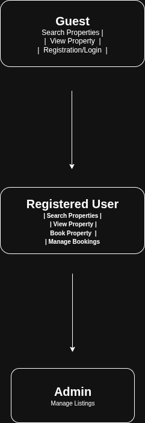

# Requirement Analysis in Software Development  

## 📖 Introduction  
This repository provides a detailed explanation of **Requirement Analysis**, a critical phase in the **Software Development Life Cycle (SDLC)**.  

The purpose of this repository is to:  
- Define what Requirement Analysis is.  
- Highlight its importance in building successful software.  
- Document the processes, types, and benefits of Requirement Analysis.  

This repo will serve as both a **learning resource** and a **reference guide** for students, developers, and teams who want to understand and apply Requirement Analysis effectively in their projects.  

---

## 🔎 What is Requirement Analysis?

**Requirement Analysis** is the process of identifying, understanding, and documenting what a software system should accomplish before development begins.  
It is one of the most important stages in the **Software Development Life Cycle (SDLC)** because it lays the foundation for design, coding, testing, and delivery.

Rather than jumping straight into building the system, teams take time to work with stakeholders—such as clients, end users, and project managers—to clarify expectations and define both the **functional** (what the system must do) and **non-functional** (how the system should perform) requirements.  

---

### 📌 Why Requirement Analysis Matters
- **Clear Understanding:** Aligns developers and stakeholders on the goals and expectations of the system.  
- **Well-defined Scope:** Establishes boundaries that help prevent *scope creep* and wasted effort.  
- **Accurate Planning:** Enables realistic estimation of cost, time, and resources needed.  
- **Quality Assurance:** Increases the likelihood that the finished product truly meets user needs.  
- **Reduced Risks:** Identifies potential issues early, before they become costly problems.  

---

### 📌 Key Activities in Requirement Analysis
1. **Gathering Requirements** – Collecting information from stakeholders using interviews, surveys, workshops, and observation.  
2. **Eliciting Details** – Digging deeper into expectations using brainstorming, prototyping, or focus group discussions.  
3. **Documenting Requirements** – Writing clear specifications, user stories, and use cases to ensure no detail is overlooked.  
4. **Analyzing and Modeling** – Prioritizing needs, checking feasibility, and creating models or diagrams to visualize the system.  
5. **Validating Requirements** – Reviewing the documented needs with stakeholders to confirm accuracy and completeness.  

---

### 📌 Functional vs. Non-functional Requirements
- **Functional Requirements:** Define *what the system should do*.  
  *Example: A user must be able to search for items and place an order.*  
- **Non-functional Requirements:** Define *how the system should behave*.  
  *Example: The system should respond to searches within 2 seconds and handle at least 1,000 users at once.*  

---

✅ In summary, Requirement Analysis ensures that the **right problem is being solved** before a single line of code is written. By clarifying expectations early, it increases efficiency, reduces risks, and helps deliver software that meets both business objectives and user needs.

## 🌟 Why is Requirement Analysis Important?

Requirement Analysis is not just an initial step in software development — it is the **foundation** upon which the success of the entire project depends. Without it, teams risk building the wrong product, wasting resources, and missing deadlines.  

Here are some key reasons why it is critical in the **SDLC**:  

1. **Clarity and Shared Understanding**  
   - Brings all stakeholders (clients, users, developers, managers) onto the same page.  
   - Eliminates ambiguity by ensuring everyone agrees on what the system should do.  

2. **Defining the Project Scope**  
   - Sets clear boundaries on what will be built and what will not.  
   - Helps prevent *scope creep* — the gradual, uncontrolled growth of project features that leads to delays and budget overruns.  

3. **Accurate Planning and Estimation**  
   - Provides the details needed to estimate time, cost, and resources more precisely.  
   - Supports better project scheduling and resource allocation.  

4. **Foundation for Design and Testing**  
   - Serves as the blueprint for creating technical designs, user interfaces, and system workflows.  
   - Ensures testing criteria are aligned with real requirements, increasing product quality.  

5. **Risk Reduction**  
   - Identifies potential challenges early, allowing teams to address feasibility, performance, or security concerns before development begins.  

---

✅ In short, **Requirement Analysis reduces risks, improves quality, and ensures that the final software truly meets the user’s needs** — making it one of the most crucial phases of the SDLC.

## 🛠️ Key Activities in Requirement Analysis

Requirement Analysis involves a series of structured activities that ensure the software being developed is well-understood, feasible, and aligned with stakeholder needs.  
The five key activities are:  

### 1. Requirement Gathering 🗂️
- Collects raw information directly from stakeholders such as clients, end users, and business analysts.  
- Techniques include **interviews, surveys, workshops, observation**, and reviewing existing documentation.  
- The goal is to understand *what stakeholders need* from the system.  

### 2. Requirement Elicitation ✍️
- Goes beyond basic gathering to clarify, refine, and expand the collected requirements.  
- Involves methods such as **brainstorming, prototyping, and focus group discussions**.  
- Helps uncover hidden or conflicting requirements that may not be obvious at first.  

### 3. Requirement Documentation 📚
- Converts gathered and elicited requirements into a structured, written form.  
- Common formats include **Software Requirement Specification (SRS)** documents, **user stories**, and **use cases**.  
- Clear documentation acts as a reference point for all project stakeholders throughout the SDLC.  

### 4. Requirement Analysis and Modeling 📊
- Evaluates requirements to check for **feasibility, priority, and consistency**.  
- Creates visual models such as **data flow diagrams, entity-relationship diagrams, or UML use case diagrams** to better understand system behavior.  
- Ensures requirements are realistic and aligned with project goals.  

### 5. Requirement Validation ✅
- Reviews documented requirements with stakeholders to confirm accuracy and completeness.  
- Defines **acceptance criteria** for each requirement, ensuring they can be tested and verified.  
- Establishes **traceability**, linking requirements to design, development, and testing to ensure nothing is missed.  

---

✅ These activities work together to ensure that the software product is **well-defined, feasible, and aligned with stakeholder expectations**, reducing risks and increasing the chances of project success.

##  Types of Requirements

The requirements of a software system are typically categorized into **Functional Requirements** and **Non-functional Requirements**. Understanding the difference between these two types is crucial for designing, developing, and delivering a successful system.

---

### 1 Functional Requirements ⚙️

**Definition:** Functional requirements describe *what the system should do*. They define the core features and behaviors that the system must provide to fulfill the user’s needs.

**Examples for the Booking Management Project:**
- **User Registration:** Users should be able to create an account with personal information and login credentials.  
- **Property Search:** Users must be able to search for properties based on criteria like location, price, and availability.  
- **Booking System:** Users should be able to book properties, view booking details, and manage their reservations.  
- **User Authentication:** Secure login and password management for registered users.  
- **Property Listings:** Display property details including images, descriptions, and amenities.

---

### 2 Non-functional Requirements 🛡️

**Definition:** Non-functional requirements describe *how the system should perform*. They focus on quality attributes such as performance, usability, reliability, and security.

**Examples for the Booking Management Project:**
- **Performance:** Pages should load within 2 seconds, and the system should handle up to 1,000 concurrent users.  
- **Security:** All user data should be encrypted, and secure login protocols must be implemented.  
- **Scalability:** The system should support future growth, allowing additional users and properties without performance degradation.  
- **Usability:** The application must have an intuitive interface, making it easy for users to search properties and book them.  
- **Reliability:** The system should maintain 99.9% uptime and recover quickly from failures.

## Use Case Diagrams

**Objective:** Illustrate the use of Use Case Diagrams in Requirement Analysis.

---

### What are Use Case Diagrams?

Use Case Diagrams are visual representations that show how different users (called **actors**) interact with a system to achieve specific goals (called **use cases**).  
They help in understanding system functionality, identifying requirements, and communicating system behavior clearly with stakeholders.

**Benefits of Use Case Diagrams:**
- Provide a clear visual representation of system functionalities.
- Help organize and prioritize requirements.
- Facilitate communication between developers, stakeholders, and clients.
- Aid in identifying missing functionalities early in the design phase.

---

### Example Use Case Diagram for Booking System

**Actors:**
- Guest
- Registered User
- Admin

**Use Cases:**
- Search Properties
- View Property Details
- Book Property
- Manage Bookings
- Manage Listings
- User Registration / Login

**Diagram:**  

*Note:* The diagram was created using Draw.io and exported as `alx-booking-uc.png`.

